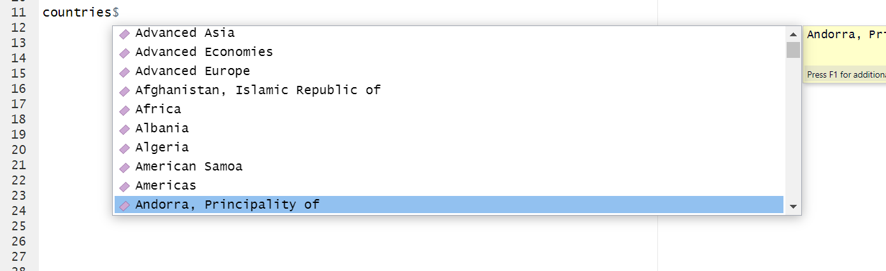

# README.qmd


## imfidatar

`imfidatar` makes it easy to access imf data (from `data.imf.org`) in R.
It helps you build the key, find the available variables and stores your
login credentials on your computer so you do not need to login every
time.

## Installing

On most computers you should be able to install `imfidatar` with

``` r
library(remotes )
remotes::install_git('https://github.com/BasBBakkerIMF/imfidatar.git')
```

On IMF computers that does not work. Instead do the below:

``` r
#
url <- "https://codeload.github.com/BasBBakkerIMF/imfidatar/tar.gz/HEAD"
tf  <- tempfile(fileext = ".tar.gz")

curl::curl_download(url, tf)        # fetch with curl
remotes::install_local(tf)          # install from the downloaded file
```

After you have installed it, you need to load it:

``` r
library(imfidatar)
```

    imfidatar loaded.

## Publicly accessible datasets:

To show the publicly available datasets:

``` r
datasets=idata$metadata$imfdata_show_datasets()

head(datasets)
```

           id agencyID
    1  AFRREO  IMF.AFR
    2     HPD  IMF.FAD
    3      PI  IMF.STA
    4  APDREO  IMF.APD
    5 MFS_ODC  IMF.STA
    6     DIP  IMF.STA
                                                                     Name.en
    1                  Sub-Saharan Africa Regional Economic Outlook (AFRREO)
    2                                           Historical Public Debt (HPD)
    3                                                Production Indexes (PI)
    4                    Asia and Pacific Regional Economic Outlook (APDREO)
    5 Monetary and Financial Statistics (MFS), Other Depository Corporations
    6     Direct Investment Positions by Counterpart Economy (formerly CDIS)
      version  uri
    1   6.0.1 <NA>
    2   1.0.0 <NA>
    3   2.0.0 <NA>
    4   6.0.0 <NA>
    5   9.0.1 <NA>
    6  12.0.0 <NA>
                                                                            urn
    1  urn:sdmx:org.sdmx.infomodel.datastructure.Dataflow=IMF.AFR:AFRREO(6.0.1)
    2     urn:sdmx:org.sdmx.infomodel.datastructure.Dataflow=IMF.FAD:HPD(1.0.0)
    3      urn:sdmx:org.sdmx.infomodel.datastructure.Dataflow=IMF.STA:PI(2.0.0)
    4  urn:sdmx:org.sdmx.infomodel.datastructure.Dataflow=IMF.APD:APDREO(6.0.0)
    5 urn:sdmx:org.sdmx.infomodel.datastructure.Dataflow=IMF.STA:MFS_ODC(9.0.1)
    6    urn:sdmx:org.sdmx.infomodel.datastructure.Dataflow=IMF.STA:DIP(12.0.0)
      isExternalReference isFinal validFrom validTo dsdRef Name.fr Name.ar Name.es
    1               FALSE    TRUE      <NA>    <NA>   <NA>    <NA>    <NA>    <NA>
    2               FALSE    TRUE      <NA>    <NA>   <NA>    <NA>    <NA>    <NA>
    3               FALSE    TRUE      <NA>    <NA>   <NA>    <NA>    <NA>    <NA>
    4               FALSE    TRUE      <NA>    <NA>   <NA>    <NA>    <NA>    <NA>
    5               FALSE    TRUE      <NA>    <NA>   <NA>    <NA>    <NA>    <NA>
    6               FALSE    TRUE      <NA>    <NA>   <NA>    <NA>    <NA>    <NA>
      Name.pt Name.ja Name.zh Name.ru
    1    <NA>    <NA>    <NA>    <NA>
    2    <NA>    <NA>    <NA>    <NA>
    3    <NA>    <NA>    <NA>    <NA>
    4    <NA>    <NA>    <NA>    <NA>
    5    <NA>    <NA>    <NA>    <NA>
    6    <NA>    <NA>    <NA>    <NA>

Some datasets are not publicly available. To see all datasets (including
non-public datasets) use:

``` r
datasets=idata$metadata$imfdata_show_datasets(needs_auth = TRUE)
```

    Using authorization_code flow

    Loading cached token

You will be asked to sign in.


After you have been authenticated, you can see the available datasets:

``` r
head(datasets)
```

                                        id    agencyID
    1                                  TEG     IMF.STA
    2           DF_EIP_WPLF_SEX_AGE_MTS_NB         ILO
    3 WEO_LIVE_2020_JAN_ICP2017PPP_VINTAGE IMF.RES.WEO
    4                                 ICSD     IMF.FAD
    5                                  EER     IMF.STA
    6                             GAS_LIVE IMF.RES.GAS
                                                    Name.en version  uri
    1                 Trade in Energy Efficient Goods (TEG)   3.0.1 <NA>
    2 Potential labour force by sex, age and marital status     1.0 <NA>
    3            WEO Live 2020 January (ICP2017PPP Weights)   1.0.0 <NA>
    4           Investment and Capital Stock Dataset (ICSD)   1.0.0 <NA>
    5                         Effective Exchange Rate (EER)   6.0.0 <NA>
    6                         Global Assumptions (GAS) Live   3.0.0 <NA>
                                                                                                             urn
    1                                      urn:sdmx:org.sdmx.infomodel.datastructure.Dataflow=IMF.STA:TEG(3.0.1)
    2                     urn:sdmx:org.sdmx.infomodel.datastructure.Dataflow=ILO:DF_EIP_WPLF_SEX_AGE_MTS_NB(1.0)
    3 urn:sdmx:org.sdmx.infomodel.datastructure.Dataflow=IMF.RES.WEO:WEO_LIVE_2020_JAN_ICP2017PPP_VINTAGE(1.0.0)
    4                                     urn:sdmx:org.sdmx.infomodel.datastructure.Dataflow=IMF.FAD:ICSD(1.0.0)
    5                                      urn:sdmx:org.sdmx.infomodel.datastructure.Dataflow=IMF.STA:EER(6.0.0)
    6                             urn:sdmx:org.sdmx.infomodel.datastructure.Dataflow=IMF.RES.GAS:GAS_LIVE(3.0.0)
      isExternalReference isFinal validFrom validTo dsdRef
    1               FALSE    TRUE      <NA>    <NA>   <NA>
    2               FALSE    TRUE      <NA>    <NA>   <NA>
    3               FALSE    TRUE      <NA>    <NA>   <NA>
    4               FALSE    TRUE      <NA>    <NA>   <NA>
    5               FALSE    TRUE      <NA>    <NA>   <NA>
    6               FALSE    TRUE      <NA>    <NA>   <NA>
                                                          Name.fr
    1                                                        <NA>
    2 Main-d'oeuvre potentielle par sexe, éducation et état civil
    3                                                        <NA>
    4                                                        <NA>
    5                                                        <NA>
    6                                                        <NA>
                                                               Name.es Name.ar
    1                                                             <NA>    <NA>
    2 Fuerza de trabajo potencial según sexo, educación y estado civil    <NA>
    3                                                             <NA>    <NA>
    4                                                             <NA>    <NA>
    5                                                             <NA>    <NA>
    6                                                             <NA>    <NA>
      Name.pt Name.ja Name.zh Name.ru
    1    <NA>    <NA>    <NA>    <NA>
    2    <NA>    <NA>    <NA>    <NA>
    3    <NA>    <NA>    <NA>    <NA>
    4    <NA>    <NA>    <NA>    <NA>
    5    <NA>    <NA>    <NA>    <NA>
    6    <NA>    <NA>    <NA>    <NA>

## Querying data

To query data you need to know both the dataset and a key. For the
dataset you use the **agencyID** column in the dataset table. We will
explain later how to build the key. For now, understand that for two
**countries** (NLD and USA) we asked data for two **indicators**
unemployment (LUR) and the CPI (PCPI), with annual **frequency**.

``` r
library(dplyr)
```


    Attaching package: 'dplyr'

    The following objects are masked from 'package:stats':

        filter, lag

    The following objects are masked from 'package:base':

        intersect, setdiff, setequal, union

``` r
weodata=idata$retrieval$imfdata_by_key(dataset = "IMF.RES:WEO", 
                                       key = "USA+NLD.LUR+PCPI.A")
```

    [rsdmx][INFO] Fetching 'https://api.imf.org/external/sdmx/2.1/data/IMF.RES,WEO/USA+NLD.LUR+PCPI.A/all/' 

``` r
weodata %>% select(COUNTRY,INDICATOR,TIME_PERIOD,value) %>% tail()
```

        COUNTRY INDICATOR TIME_PERIOD   value
    199     USA      PCPI        2025 323.070
    200     USA      PCPI        2026 331.035
    201     USA      PCPI        2027 338.021
    202     USA      PCPI        2028 345.307
    203     USA      PCPI        2029 352.797
    204     USA      PCPI        2030 360.470

## Building the key

To build the key, you first need to find the **dimensions.**

``` r
dims=idata$metadata$get_dimension_names("IMF.RES:WEO") 
```

    [rsdmx][INFO] Fetching 'https://api.imf.org/external/sdmx/2.1/datastructure/all/DSD_WEO/latest/?references=descendants' 
      Dimension
    1   COUNTRY
    2 INDICATOR
    3      FREQ

``` r
dims
```

      Dimension
    1   COUNTRY
    2 INDICATOR
    3      FREQ

There are three dimension names, and in the key you need to put them in
that order.

## Dimension values

``` r
countries=idata$metadata$make_dimension_env("IMF.RES:WEO", "COUNTRY")
```

Now if type in `countries$` a dropdown menu will show up.



If you choose `United States` you will see that the code for this
country is `USA`.

``` r
countries$`United States`
```

    [1] "USA"

We make similar dropdown for the other variables:

``` r
indicators=idata$metadata$make_dimension_env(dataset_or_db = "IMF.RES:WEO",dimension = "INDICATOR")
frequencies=idata$metadata$make_dimension_env(dataset_or_db ="IMF.RES:WEO","FREQ")
```

## Building the key.

We can now build the key. For each dimension, we choose the relevant
varaibles.

``` r
mycountries = list(countries$`Netherlands, The`,countries$`United States`)
mycountries
```

    [[1]]
    [1] "NLD"

    [[2]]
    [1] "USA"

``` r
myindicators=list(indicators$`Unemployment rate`,indicators$`Gross domestic product (GDP), Constant prices, Domestic currency`)
myindicators
```

    [[1]]
    [1] "LUR"

    [[2]]
    [1] "NGDP_R"

``` r
myfrequencies=list(frequencies$Annual)
myfrequencies
```

    [[1]]
    [1] "A"

Finally we combine this in a key:

``` r
mykey=list(mycountries,myindicators,myfrequencies)
```

To see the key, We can make a string from it:

``` r
mykeystr=idata$utils$make_key_str(mykey)
mykeystr
```

    [1] "NLD+USA.LUR+NGDP_R.A"

``` r
weo_data=idata$retrieval$imfdata_by_key(dataset = "IMF.RES:WEO",key=mykey)
```

    [rsdmx][INFO] Fetching 'https://api.imf.org/external/sdmx/2.1/data/IMF.RES,WEO/NLD+USA.LUR+NGDP_R.A/all/' 

``` r
weo_data %>% select(COUNTRY,INDICATOR,TIME_PERIOD,value) %>% tail()
```

        COUNTRY INDICATOR TIME_PERIOD        value
    199     USA    NGDP_R        2025 2.373055e+13
    200     USA    NGDP_R        2026 2.414443e+13
    201     USA    NGDP_R        2027 2.462312e+13
    202     USA    NGDP_R        2028 2.514551e+13
    203     USA    NGDP_R        2029 2.567898e+13
    204     USA    NGDP_R        2030 2.622377e+13

For WEO data, it is easy to build the key by hand, but for some other
datasets it is less straightforward.

## Accessing Restricted Data

To access restricted data you need to `needs_auth=T` to the
`imfdata_by_key`function. We will give an example using Bloomberg data.

To prevent any typos, we create a dropdown menu of datasets:

``` r
mydatasets=idata$metadata$make_dataset_env(needs_auth = T)
```

In the dropdown menu we quickly find the `Bloomberg Data License`:

``` r
bloomberg=mydatasets$`Bloomberg Data License `
bloomberg
```

    [1] "IMF.CSF:BBGDL"

We next check what the dimensions are:

``` r
dims=idata$metadata$get_dimension_names(mydatasets$`Bloomberg Data License `)
```

    [rsdmx][INFO] Fetching 'https://api.imf.org/external/sdmx/2.1/datastructure/all/DSD_BBGDL/latest/?references=descendants' 
         Dimension
    1       TICKER
    2 MARKET_FIELD
    3         FREQ

``` r
dims
```

         Dimension
    1       TICKER
    2 MARKET_FIELD
    3         FREQ

For each of the dimensions, we build a dropdown list

``` r
tickers=idata$metadata$make_dimension_env(dataset_or_db = bloomberg,dimension = "TICKER")
fields=idata$metadata$make_dimension_env(dataset_or_db = bloomberg,dimension = "MARKET_FIELD")
freqs=idata$metadata$make_dimension_env(dataset_or_db = bloomberg,dimension = "FREQ")
```

We build the key

``` r
bb_key = list(
     c(tickers$`ALBANIAN LEK SPOT`),
   c(fields$`Ask Price`, fields$`Bid Price`),
   c(freqs$Daily)
 )
```

``` r
bb_data=idata$retrieval$imfdata_by_key(dataset = bloomberg,needs_auth = T,key=bb_key,needs_labels = F)
```

    [rsdmx][INFO] Fetching 'https://api.imf.org/external/sdmx/2.1/data/IMF.CSF,BBGDL/ALL_CURNCY.PX_ASK+PX_BID.D/all/' 

``` r
tail(bb_data)
```

              TICKER  FIELD FREQUENCY SCALE TIME_PERIOD OBS_VALUE value
    14306 ALL_CURNCY PX_BID         D     0  2025-08-29     83.41 83.41
    14307 ALL_CURNCY PX_BID         D     0  2025-09-01     83.24 83.24
    14308 ALL_CURNCY PX_BID         D     0  2025-09-02     83.63 83.63
    14309 ALL_CURNCY PX_BID         D     0  2025-09-03     83.18 83.18
    14310 ALL_CURNCY PX_BID         D     0  2025-09-04     83.04 83.04
    14311 ALL_CURNCY PX_BID         D     0  2025-09-05     82.62 82.62

## Labels

In many datasets indicator names are pretty easy to understand. In some
datasets they are much more obscure. For example, in the `BOP` database,
`SL` is the indicator name for `Government goods and services n.i.e.`

In such a case, you also download labels with the data.

``` r
library(dplyr)
keystr <- "CRI+HND+GTM+NIC+PAN+DOM+SLV.CD_T.S+SA+SB+SC+SD+SE+SF+SG+SH+SI+SJ+SK+SL.USD.A"

df <- idata$retrieval$imfdata_by_key(
  dataset = "IMF.STA:BOP",
  needs_auth = FALSE,
  key = keystr,
  needs_labels = TRUE
)
```

Finally we show the data:

``` r
df2 <- df %>% select(COUNTRY, INDICATOR, INDICATOR_label.en.label, TIME_PERIOD, value)
tail(df2)
```

         COUNTRY INDICATOR             INDICATOR_label.en.label TIME_PERIOD
    3508     SLV        SL Government goods and services n.i.e.        2019
    3509     SLV        SL Government goods and services n.i.e.        2020
    3510     SLV        SL Government goods and services n.i.e.        2021
    3511     SLV        SL Government goods and services n.i.e.        2022
    3512     SLV        SL Government goods and services n.i.e.        2023
    3513     SLV        SL Government goods and services n.i.e.        2024
             value
    3508 109168831
    3509 104664550
    3510 128046584
    3511 173681317
    3512 167231356
    3513 159268868
